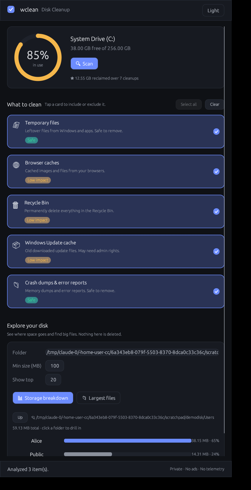
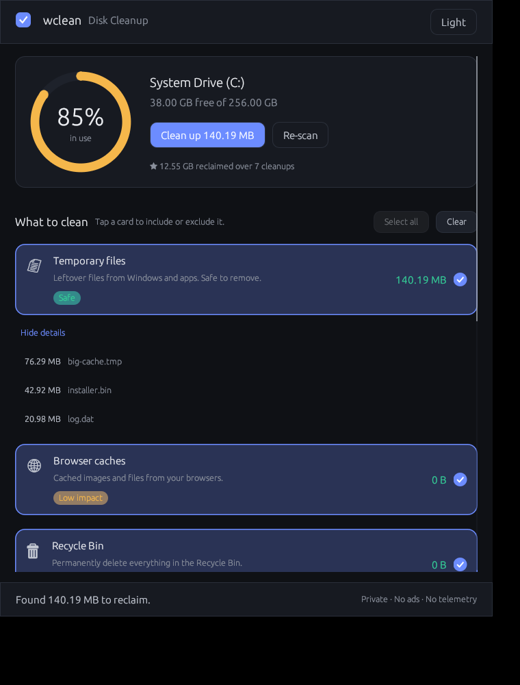

# wclean

A safe, fast **C: drive cleanup tool for Windows**, written in Rust.

`wclean` reclaims disk space from the usual suspects — temporary files, browser
caches and the Recycle Bin — and can point you at the largest files on a drive
so you can decide what else to remove. It ships as both a **command-line tool**
(colored output) and a **graphical app** (egui), and every destructive action is
**opt-in and confirmed**.


> Designed trust-first. See the [Product Brief](docs/PRODUCT.md) for what we
> build and why, and the [Design System](docs/DESIGN.md) for how it looks and
> feels.

## Features

| Category            | What it cleans                                                        |
| ------------------- | -------------------------------------------------------------------- |
| Temporary files     | `%TEMP%`, `%TMP%`, `C:\Windows\Temp`, and `Prefetch`                  |
| Browser caches      | Chrome, Edge, Brave and Firefox caches (all profiles)                |
| Recycle Bin         | Empties the Recycle Bin across all drives (Win32 Shell API)          |
| Windows Update cache| Old payloads in `SoftwareDistribution\Download` (may need admin)      |
| Crash dumps         | Crash dumps and Windows Error Reporting queues                       |
| Storage breakdown   | See what's using space in any folder, as proportional bars — **report only** |
| Large file scan     | Reports the biggest files under a path — **report only, never deletes** |

### Safety first

- `scan` and `--dry-run` never touch the disk — they only measure.
- `clean` shows you exactly what it found and **asks for confirmation** before
  deleting (skip with `--yes` for automation).
- Files that are locked or in use are skipped, never forced — wclean reports how
  many it had to leave behind.
- The large-file scanner only *lists* files. It will never delete your data.

## Install / Build

Requires a [Rust toolchain](https://rustup.rs/).

```sh
# Command-line tool
cargo build --release
# -> target/release/wclean.exe

# Graphical app (egui) — enable the `gui` feature
cargo build --release --features gui --bin wclean-gui
# -> target/release/wclean-gui.exe
```

The Recycle Bin feature uses Win32 Shell APIs and only works on Windows. The
project still builds and tests run on Linux/macOS (the Recycle Bin becomes a
no-op), which keeps development possible off-Windows.

## Graphical app

`wclean-gui` gives you the same four features in a window:

- Tick the categories you want, **Scan** to preview reclaimable space, then
  **Clean selected…** — a confirmation dialog lists exactly what will be deleted.
- Scans and cleans run on a background thread, so the window stays responsive.
- The **Large files** panel lists the biggest files under any folder (report
  only — it never deletes).
- **Storage breakdown** — analyze a folder and see what's eating the space as
  ranked proportional bars. Click any folder to **drill in**, with a breadcrumb
  and "Up" button — an explorable disk map.
- **Drill down** into any category after a scan to preview the largest files it
  would remove — see exactly what you're deleting before you delete it.


- The app **remembers your lifetime stats** (total reclaimed, cleanups run) and
  surfaces them in the header.
- **Keyboard:** Enter runs the primary action (scan → confirm), Esc cancels.



```sh
cargo run --release --features gui --bin wclean-gui
```

### Environment variables

| Variable           | Effect                                                          |
| ------------------ | -------------------------------------------------------------- |
| `WCLEAN_THEME`     | `light` or `dark` — initial theme (default `dark`)             |
| `WCLEAN_DEMO_DISK` | `freeGB:totalGB` — inject a demo drive gauge off-Windows (dev) |

The GUI remembers your theme, category selection and large-file settings
between launches in `%APPDATA%\wclean\config` (`~/.config/wclean/config`
elsewhere). `WCLEAN_THEME`, if set, overrides the saved theme.

## Usage

```sh
# See how much space you could reclaim (nothing is deleted)
wclean scan

# Scan only specific categories
wclean scan temp browser

# Preview a clean without deleting
wclean clean --dry-run

# Clean everything, with a confirmation prompt
wclean clean

# Clean without prompting (for scripts / scheduled tasks)
wclean clean --yes

# Clean only the Recycle Bin
wclean clean recyclebin --yes

# Find the 20 largest files on C: that are at least 100 MB
wclean large

# Find big files under a specific folder
wclean large "D:\Downloads" --min-mb 50 --top 30

# See what's using space in a folder (proportional breakdown)
wclean breakdown "C:\" --top 15
```

### Categories

`temp`, `browser`, `recyclebin`, `windows-update`, `crash-dumps` — pass any
subset to `scan`/`clean`, or none to act on all of them.

## Notes

- Some system temp files and an in-use Recycle Bin may require running the tool
  from an **elevated (Administrator)** prompt to fully clean.
- Close your browser before cleaning its cache so locked files can be removed.

## Project layout

```
src/
  lib.rs             Core library: re-exports cleaner + util (shared by CLI/GUI)
  main.rs            CLI binary: entry point and command flow
  cli.rs             CLI argument parsing (clap)
  ui.rs              CLI terminal output, prompts, formatting
  bin/
    gui.rs           GUI binary: egui front-end (feature = "gui")
  util.rs            Byte formatting, directory sizing, safe deletion
  cleaner/
    mod.rs           Category definitions and dispatch
    temp.rs          Temporary-file locations
    browser.rs       Browser cache discovery (Chrome/Edge/Brave/Firefox)
    recyclebin.rs    Recycle Bin via Win32 Shell API
    largefiles.rs    Bounded-memory large-file scanner
```

## License

MIT
