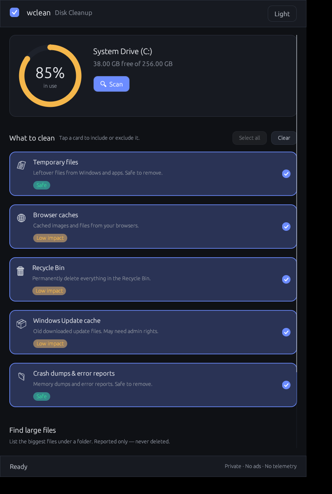
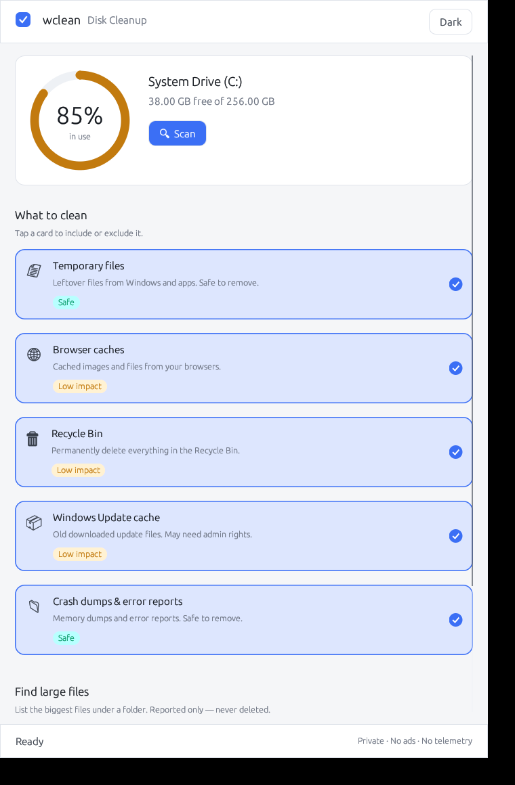

# wclean — Design System

> How the product looks and feels. Companion to
> [`PRODUCT.md`](PRODUCT.md) (what we build and why).

The whole GUI is driven by a small set of tokens in
[`src/gui/theme.rs`](../src/gui/theme.rs), rendered by painted components in
[`src/gui/widgets.rs`](../src/gui/widgets.rs). Change a token, and the change
propagates everywhere — consistency by construction.

## Design principles

1. **Calm, not alarming.** A cleaner shouldn't shout. Muted surfaces, generous
   whitespace, one accent color. No red unless something is genuinely at risk.
2. **One clear next step.** Exactly one primary action is emphasized at a time:
   *Scan* → *Clean up X* → done. Everything else is secondary (ghost) or quiet.
3. **Show state honestly.** Empty, scanning, results, and success each look
   distinct. The drive gauge turns amber then red as it fills — the UI carries
   meaning, not just decoration.
4. **Hierarchy through type and space**, not boxes-in-boxes. Weight and size
   separate a title from its description; spacing separates sections.

## Tokens

**Color** — semantic, theme-aware (`Palette::dark()` / `light()`):
`bg`, `surface`, `surface_alt`, `border`, `text_strong`, `text`, `text_muted`,
and intents `accent`, `success`, `warning`, `danger`. The accent (indigo) is the
brand and the only "loud" hue; status colors are reserved for status.

**Type scale** — Heading 24 · Body 15 · Button 15 · Small 12.5. One proportional
family, three weights of emphasis. Restraint over variety.

**Spacing** — a 6/10/16/24 rhythm (`space::XS…LG`) for a consistent vertical
beat.

**Radius** — Card 14 · Control 10 · Pill (full). Soft, modern, friendly.

## Components

- **Disk ring** — the hero. A painted gauge showing `C:` usage with the percent
  in the middle; color shifts accent → amber → red past 75% / 90%. Turns the
  abstract problem ("disk full") into something you *feel* at a glance.
- **Category card** — the whole card is the hit target (forgiving, touch-era
  ergonomics). Icon, title, plain-language description, a **risk badge**, a
  selection check, and the reclaimable size once scanned.
- **Buttons** — `primary` (filled accent), `ghost` (outline, secondary),
  `danger` (filled red, only in the destructive confirm step).
- **Success banner** — positive reinforcement after a clean ("Freed 4.2 GB 🎉").
- **Risk badge** — a constant trust signal: *Safe* (green) / *Low impact*
  (amber).
- **Drill-down** — a quiet "Show details" disclosure under each scanned category
  reveals its largest files. Transparency on demand, without cluttering the
  default view.
- **Lifetime stat** — a subtle line in the hero ("★ 12.6 GB reclaimed over 7
  cleanups") that rewards return visits without nagging.

## Interaction & states

- **Responsive always.** Scans and cleans run on a worker thread; the window
  never blocks. A spinner + status line communicate progress.
- **Confirm before destroy.** Deletion always passes through a modal that names
  exactly what will be removed and how much it frees. Cancel is the easy default;
  the destructive action is the one that's visually "hot."
- **Graceful degradation.** Off-Windows (developer machines) the drive gauge and
  Recycle Bin degrade to honest placeholders instead of breaking.
- **Keyboard-first is possible.** Enter drives the primary action all the way
  through (scan → confirm → clean); Esc backs out of the dialog. Enter is never
  hijacked while typing in a field.

## Accessibility & theming

- Light and dark themes, toggleable at runtime and selectable via
  `WCLEAN_THEME=light|dark`. Both are tuned for legible contrast on text.
- Color is never the *only* signal — risk and status always pair color with a
  word.

## Why egui

A single self-contained native binary, no web runtime, no bundled browser, tiny
footprint — which is itself a product value (see "fast and small" in the brief).
Immediate-mode keeps state and rendering in one place, so the UI is easy to
reason about and hard to desync.
